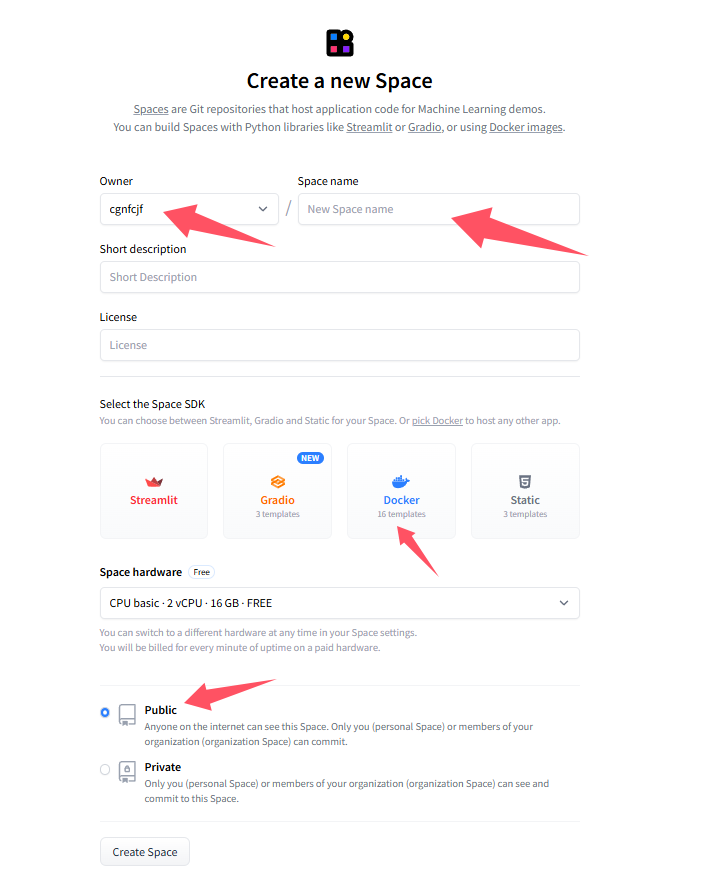
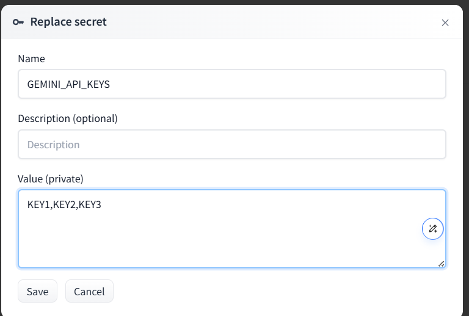

# hajimi使用教程

## 1. 安装
### 1.1 下载
- 从[releases](https://github.com/wyeeeee/hajimi/releases)下载最新版本。
- 下载完成后解压到任意目录。

    * 解压后目录结构如下：
    * 注意，在以下内容中，不需要解压app.zip
    ```
    app.zip
    Dockerfile
    requirements.txt
    version.txt
    ```


### 1.2 使用huggingface space部署项目
- 在[huggingface](https://huggingface.co)注册账号。
    * 注意：用户名不要使用任何符号
- 注册完成后，进入[spaces](https://huggingface.co/spaces)，如图所示，点击new spaces。<br> 注意：<br>
- 如图所示，填入创建选项，填写完成后，点击create space，一定要记住owner与space name，在之后的酒馆连接中要使用<br> 注意：pace name不要使用任何标点符号<br>
- 如图所示，选择upload files<br>
- 如图所示，将1.1下载并解压的文件全部拖入，上传完成后点击Commit changes to main<br> 注意：要将app.zip，Dockerfile等内容一起拖入上传，而不是上传包裹它们的外部文件夹<br>


## 2. 配置
### 2.0 什么是环境变量？
- 环境变量是操作系统用来存储有关计算机运行环境的信息的变量。环境变量可以用来配置应用程序的运行环境，例如设置应用程序的路径、配置文件的位置、数据库连接信息等。环境变量通常以键值对的形式存储，可以通过编程语言或命令行工具来访问和修改。
- （上面的内容不用看）只用知道，环境变量是配置程序运行环境的一种方式，可以用来存储一些敏感信息，例如API密钥、数据库密码等。在程序运行时，可以通过读取环境变量来获取这些信息，而不需要将它们硬编码在程序中，从而提高了程序的安全性和可维护性。
- 在本项目中，我们使用环境变量来存储huggingface的API密钥，连接密码，以及其他的配置信息，但不用担心，大部分的配置信息都已经默认帮你填好，你只需要配置huggingface的API密钥与密码即可。

### 2.1 配置基础环境变量
- 如图所示，进入settings界面<br>
- 如图所示，在settings界面中找到Variables and secrets，点击new secrets<br> 注意：为了api信息不被泄露，请一定要使用new secrets<br>
- 此时你正在进行的活动就叫做添加环境变量，即添加配置信息，在2.1中，我们将添加两个环境变量，分别是`GEMINI_API_KEYS`与`PASSWORD`，如果您不知道其他环境变量的用途，只需要添加这两个环境变量项目即可正常运行，如果您需要添加其他环境变量，请参考2.2中的环境变量说明，自行配置
- 如图所示为添加GEMINI_API_KEYS环境变量，可以看到，在name一栏中为该环境变量的名称，此时我们添加的是apikey，确保其环境变量名称即name为GEMINI_API_KEYS，而在value栏中，我们需要填入具体的apikey<br>如图所示，每个apikey之间用英文逗号分割，不需要换行，不需要填入其他信息。全部填入后点击save<br>
- 接着我们需要再次点击new secrets，添加PASSWORD环境变量，和上一步一样，我们需要在name一栏中填入PASSWORD，在value一栏中填入密码，然后点击save
- 等待项目部署完成，app界面显示如图界面，即完成<br>
- 如果您不需要配置其他环境变量，那么到此为止，您已经完成了环境变量的配置，可直接进行使用环节，如果需要配置其他环境变量，请参考2.2中的环境变量说明，自行配置

### 2.2 环境变量说明
#### 重要环境变量
- `GEMINI_API_KEYS`：从google ai studio 获取的API密钥，支持多个API密钥，以英文逗号分隔（例:apikey1,apikey2,apikey3）。
- `PASSWORD`：用户访问所需的password，如不填写默认为123。
#### 其他环境变量（这些环境变量都拥有默认值，如果您不理解这些环境变量，完全不需要设置）
-   `MAX_REQUESTS_PER_MINUTE`：（可选）每分钟最大请求数。
-   `MAX_REQUESTS_PER_DAY_PER_IP`：（可选）每天每个 IP 最大请求数。
-   `FAKE_STREAMING`：（可选）是否启用假流式传输，默认为true。
-   `API_KEY_DAILY_LIMIT`:（可选） 单api 24小时最大使用次数，默认值为25
-   `BLOCKED_MODELS`，（可选）需要屏蔽的模型名称，多个模型用英文逗号分隔
-   `RANDOM_STRING`，（可选）是否启用伪装信息，默认值为true
-   `RANDOM_STRING_LENGTH`，（可选）伪装信息长度，默认为20

## 3. 使用
### 3.1 在酒馆中使用
- 首先我们需要您确认您在1.2中记住的owner与space name，您需要在酒馆中填写的链接的格式为`https://owner-space name.hf.space/v1`，您应该同时检查二者中是否存在标点符号（注意这里的owner与space name只是代称，不是让您真的填入owner与space name这些英文单词）
- 如果您对上述内容仍有疑问，我们假设小明的owner为xiaoming，space name为gemini，那么小明在酒馆中填写的链接应为`https://xiaoming-gemini.hf.space/v1`
- 如果您想要测试以上链接是否正确，可以选择去掉链接末尾的v1，对于小明来说，链接应为`https://xiaoming-gemini.hf.space`，打开链接后，您应该正确的看到您所部署的界面
- 终于，您需要进入到酒馆界面，打开API连接配置（即插头），api选择 聊天补全，聊天补全来源选择 自定义（兼容 OpenAI），自定义端点（基础 URL）填入您的链接，自定义api秘钥填写您在2.1中配置的password，此时的酒馆应该如图所示<br>
- 如果您在填写完以上信息后，下方没有模型供您选择，请您点击连接按钮，此时您应该可以看到模型，选择模型即可使用

## 4. 注意事项
### 4.1 假流式传输模式说明
- 如需使用假流式传输模式，请确保酒馆中的预设配置里的流式传输选项为打开。
- 众所周知，gemini无法使用流式传输模式输出，但酒馆在非串流模式下等待一段时间后会自动中断连接，导致请求终止，同时酒馆不支持自定义最长等待时间，因此本项目提出假串流模式，在使用非串流模式获取gemini回复的等待期间，持续向酒馆发送空包保持连接，经测试能有效避免酒馆在gemini非串流模式下的自动中断连接情况。
- 目前项目在0.0.3测试版即后续中已默认开启假流式传输模式，如需关闭，请将环境变量`FAKE_STREAMING`设置为false。

### 4.2 常见错误
- `429报错，空回复`：内容触发了谷歌的审查机制，暂时的解决方案是在破限的最前方手动新增一栏，里面随便填点东西就不429了（或者把破线的开头那段丢给ai重新生成，意思相同，文字跟原来不同） ，或寻求破限作者/社区的帮助。
- `500报错，502报错`：谷歌服务器拒绝了此次请求。
- `408报错，酒馆断开连接`：参考1.5中假流式传输模式说明，开启假流式传输模式。
